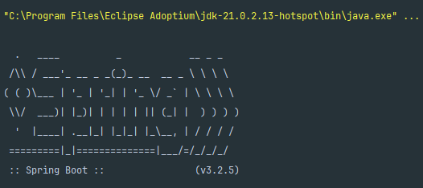

# LiterAlura

LiterAlura es una aplicación de consola desarrollada en Java 21 con Spring Boot 3.2.5, Maven 4.0.0 y PostgreSQL en Docker. La aplicación permite buscar libros a través de la API de Gutendex, guardar los libros de interés en una base de datos, y realizar diversas consultas sobre los libros y autores almacenados.

## Requisitos

- Java 21
- Maven 4.0.0
- Docker
- Docker Compose

## Configuración

### Clonar el repositorio

```bash
git clone https://github.com/omargalo/alura-literalura.git
cd alura-literalura
```
## Configurar la base de datos
Asegúrate de tener Docker y Docker Compose instalados. Luego, ejecuta el siguiente comando para iniciar una instancia de PostgreSQL:
```bash
docker-compose up -d
```
Esto iniciará un contenedor Docker con PostgreSQL configurado según el archivo docker-compose.yml incluido en el proyecto.

## Configurar las propiedades de la aplicación
En el archivo src/main/resources/application.properties, asegúrate de que las propiedades de conexión a la base de datos sean correctas:
```bash
spring.datasource.url=jdbc:postgresql://${PGDB_HOST}/literalura
spring.datasource.username=${PGDB_USER}
spring.datasource.password=${PGDB_PASSWORD}
spring.datasource.driver-class-name=org.postgresql.Driver
hibernate.dialect=org.hibernate.dialect.PostgreSQLDialect

spring.jpa.hibernate.ddl-auto=update
spring.jpa.show-sql=true
spring.jpa.format-sql=true

```
## Uso de la aplicación
Al ejecutar la aplicación, se presentará un menú con las siguientes opciones:



## Contribuciones
Las contribuciones son bienvenidas. Por favor, abre un issue o un pull request para discutir cualquier cambio.

## Licencia
Este proyecto está bajo la Licencia MIT. Consulta el archivo LICENSE para más detalles.
